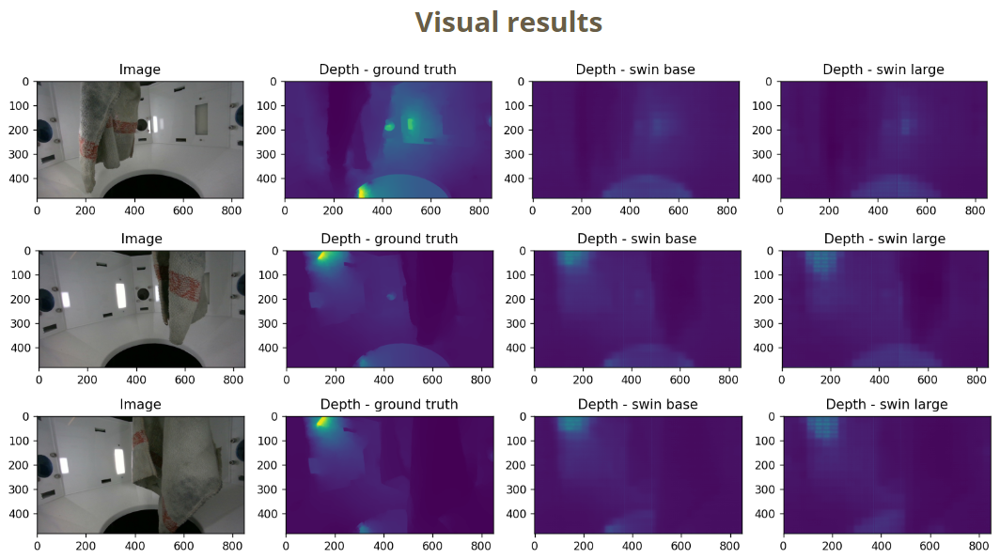

## Rapid Depth from Single Image

<p align="center">
    
  </a>
</p>

Monocular depth estimation project for "Vision and Perception" course.

### 📝 Project documentation

[**PRESENTATION**](https://github.com/mms-ngl/vp/blob/main/presentation.pdf)

### 🚀 Project setup

#### Project directory
[[Downloads]](https://drive.google.com/drive/folders/1pBjw5aPP-Nje16rCnUfcF4TCGlRLldJv?usp=drive_link) Trained PTP models for evaluation: ptp_model_swin_base.ckpt, ptp_model_swin_large.ckpt.

[[Downloads]](https://drive.google.com/drive/folders/1z0joWF-RkMEJ92PVTI3YYbmQYIn2ARBv?usp=drive_link) Weights for Swin Transformer V2 (Swin-Base and Swin-Large): swin_v2_base_simmim.pth, swin_v2_large_simmim.pth.
```
root
- ckpt
 - ptp_model_swin_base.ckpt
 - ptp_model_swin_large.ckpt
 - .placeholder
- configs
- dataset
- models
- utils
- weights
 - swin_v2_base_simmim.pth
 - swin_v2_large_simmim.pth
 - .placeholder
- README.md
- fill_depth.py
- requirements.txt
- test.py
- train.py
```

#### Dataset 
PTP dataset was obtained with Intel RealSense D405 depth camera.

#### Training
- Training with model (PTP Swin-Base)
  ```
  $ python train.py --dataset ptp --data_path ./dataset/inputs/ptp/ --max_depth 1.0 --max_depth_eval 1.0 --backbone swin_base_v2 --depths 2 2 18 2 --num_filters 32 32 32 --deconv_kernels 2 2 2 --window_size 30 30 30 15 --pretrain_window_size 12 12 12 6 --use_shift True True False False --flip_test --shift_window_test --shift_size 2 --pretrained weights/swin_v2_base_simmim.pth --save_model --auto_resume --crop_h 480 --crop_w 480 --layer_decay 0.9 --drop_path_rate 0.3 --log_dir logs/ 
  ```

- Training with model (PTP Swin-Large)
  ```
  $ python train.py --dataset ptp --data_path ./dataset/inputs/ptp/ --max_depth 1.0 --max_depth_eval 1.0  --backbone swin_large_v2 --depths 2 2 18 2 --num_filters 32 32 32 --deconv_kernels 2 2 2 --window_size 30 30 30 15 --pretrain_window_size 12 12 12 6 --use_shift True True False False --flip_test --shift_window_test --shift_size 2 --pretrained weights/swin_v2_large_simmim.pth --auto_resume --save_model --crop_h 480 --crop_w 480 --layer_decay 0.85 --drop_path_rate 0.5 --log_dir logs/ 
  ```


#### Evaluation
- Evaluate with model (PTP Swin-Base) (save_visualize)
  ```
  $ python test.py --eval_name swinbase25 --dataset ptp --data_path ./dataset/inputs/ptp/ --max_depth 1.0 --max_depth_eval 1.0  --backbone swin_base_v2 --depths 2 2 18 2 --num_filters 32 32 32 --deconv_kernels 2 2 2 --window_size 30 30 30 15 --pretrain_window_size 12 12 12 6 --use_shift True True False False --flip_test --shift_window_test --shift_size 2 --do_evaluate --save_visualize --result_dir ./outputs/ --ckpt_dir ckpt/ptp_model_swin_base.ckpt
  ```

- Evaluate with model (PTP Swin-Base) (save_eval_pngs) 
  ```
  $ python test.py --eval_name swinbase25 --dataset ptp --data_path ./dataset/inputs/ptp/ --max_depth 1.0 --max_depth_eval 1.0  --backbone swin_base_v2 --depths 2 2 18 2 --num_filters 32 32 32 --deconv_kernels 2 2 2 --window_size 30 30 30 15 --pretrain_window_size 12 12 12 6 --use_shift True True False False --flip_test --shift_window_test --shift_size 2 --do_evaluate --save_eval_pngs --result_dir ./outputs/ --ckpt_dir ckpt/ptp_model_swin_base.ckpt
  ```

- Evaluate with model (PTP Swin-Large) (save_eval_pngs)
  ```
  $ python test.py --eval_name swinlarge25 --dataset ptp --data_path ./dataset/inputs/ptp/ --max_depth 1.0 --max_depth_eval 1.0  --backbone swin_large_v2 --depths 2 2 18 2 --num_filters 32 32 32 --deconv_kernels 2 2 2 --window_size 30 30 30 15 --pretrain_window_size 12 12 12 6 --use_shift True True False False --flip_test --shift_window_test --shift_size 2 --do_evaluate --save_eval_pngs --result_dir ./outputs/ --ckpt_dir ckpt/ptp_model_swin_large.ckpt
  ```

### Acknowledge

The course project is based on MIM-Depth-Estimation[1]. The MIM-Depth-Estimation code is derived from GLPDepth[2], SwinTransformer[3] and Simple Baseline[4].

[1] [Revealing the Dark Secrets of Masked Image Modeling (Depth Estimation)](https://github.com/SwinTransformer/MIM-Depth-Estimation)

[2] [Global-Local Path Networks for Monocular Depth Estimation with Vertical CutDepth](https://github.com/vinvino02/GLPDepth)

[3] [Swin Transformer: Hierarchical Vision Transformer using Shifted Windows](https://github.com/microsoft/Swin-Transformer)

[4] [Simple Baselines for Human Pose Estimation and Tracking](https://github.com/microsoft/human-pose-estimation.pytorch)
